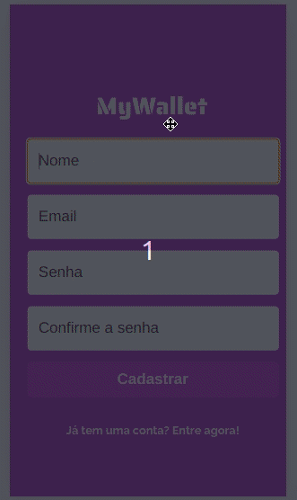

# My Wallet

My Wallet is an application for managing your financial life

Try it out now: <a href="my-wallet-iota.vercel.app">my-wallet-iota.vercel.app</a>



<br>

# About

It's a web application designed for mobile devices. You can easily create an account and start to manage your financial life.

Features:

- [X] Add new transactions
- [X] See your current Balance
- [X] List all of your transactions
- [X] Edit the amount of either a deposit or a withdraw
- [X] Delete any transaction

# Technologies

The following tools and frameworks were used to create the app

<p align="center">


<p>

# How to run

1. Clone this repository
2. Install dependecies with npm

```bash
npm install
```

3. Run the app

```bash
npm run start
```

4. You might want to build the app

```bash
npm run build
```

5. Acess the link http://localhost:3000/
